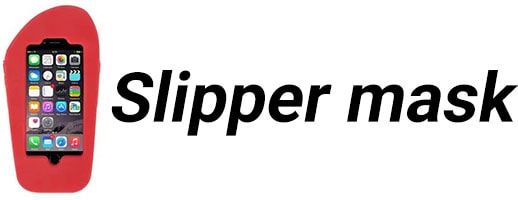

#👟 Slipper-mask
**A simple JavaScript library for masking HTML input fields.**




[](https://travis-ci.org/Arver1/slipper-mask)


[](https://github.com/prettier/prettier)

[](https://codecov.io/gh/arver1/slipper-mask)
##Installation
<pre>npm install --save slipper-mask</pre>

or

<pre>yarn add final-form</pre>

##Usage

```js
import { createMask, subscribe } from 'slipper-mask';
```
